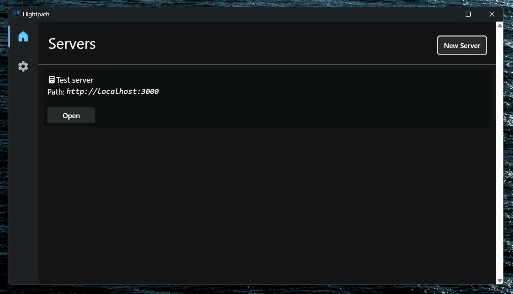
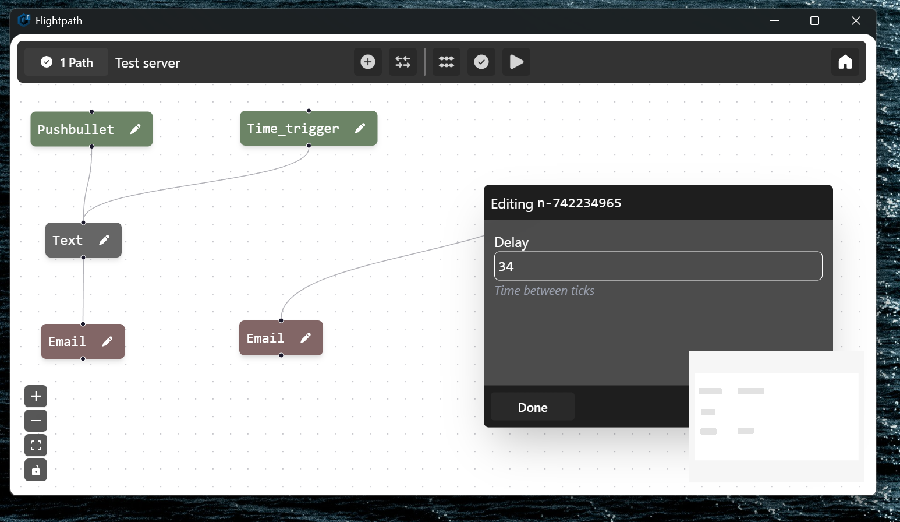

# Flightpath, the data Automator
**Not a node red clone; flightpath is for moving data, not logic!**

## Features
* Move you data around easily
* Completely Realtime
* Very Multithreaded
* Easy to use UI (Windows only for now)
* ARM Native!
* Easily expandable

## HOW TO RUN (previously setup)
1. Get the server for your platform
2. Copy the config from this repo
4. Change the config so the api key is something **other than test**
5. Run the server
6. Run the UI and add the server, http://localhost:3000 should be the default path
7. Edit your path

## Screenshots

## To-Do

 - [ ] Add support to the UI for adding paths (svelte)
 - [ ] Redesign the node creation api (go)
 - [ ] Fix random UI bugs (svelte)
 - [ ] More configuration options (go)
